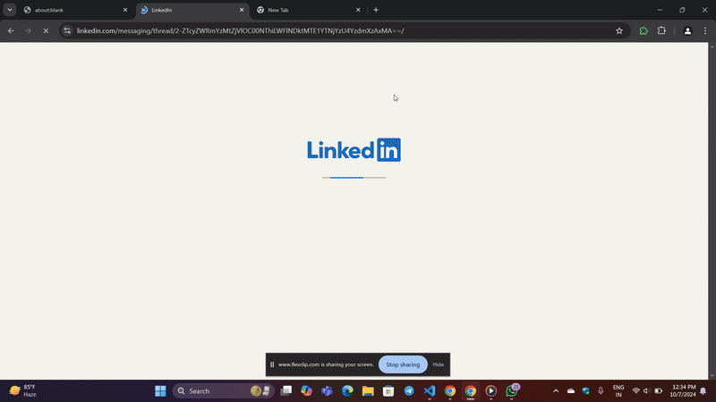
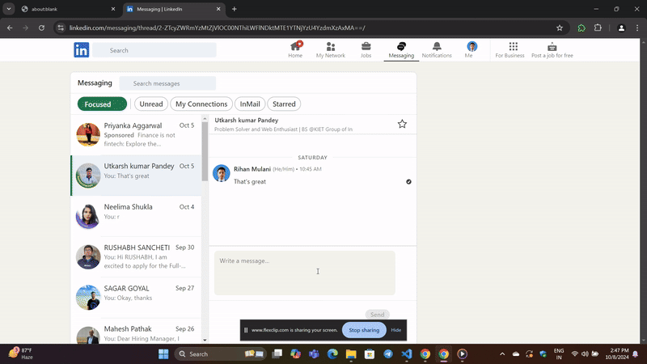

## demo video

## Upadte Version Demo 

Cloudflare AI Workers Integration for Language Translation
I have integrated Cloudflare AI Workers to enable automatic translation of responses into various languages.

## LinkedIn Message Assistant
This Chrome extension integrates an AI assistant into LinkedIn's message input field to help generate message content quickly and efficiently.

## **Completed Tasks **

1 - Show the AI icon when the user focuses on the LinkedIn message input field.
2 - The icon disappears when the input field is no longer focused.
3 - Display a center-aligned modal upon clicking the icon.
4 - Clicking outside the modal closes it.
5 - Users can enter any command in the modal’s input field.
6 - Clicking the “Generate” button displays a dummy response:
"Thank you for the opportunity! If you have any more questions or if there's anything else I can help you with, feel free to ask."
The “Regenerate” button is non-functional at this stage.
7- Clicking the "Insert" button inserts the generated text into the LinkedIn message input field.

## WXT with React 

for run this code : npm run dev 

## adding(onprocess) extra feture just for my curiosty :
attech cloudworkrs ai to autumatic generated text 